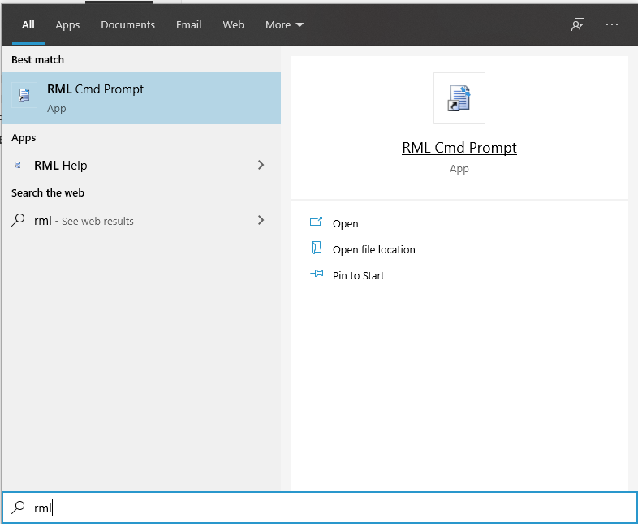
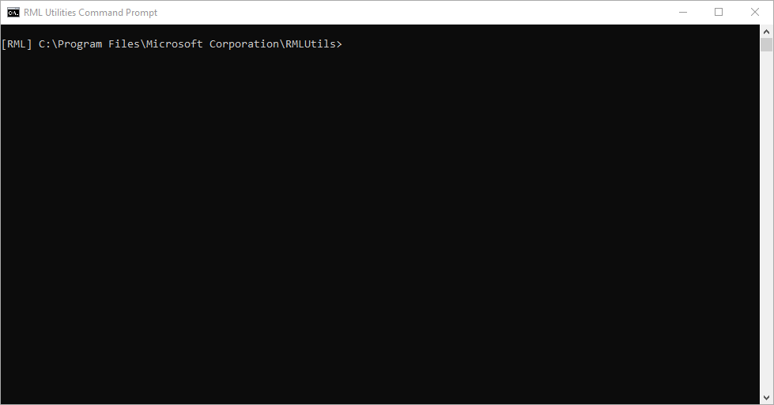
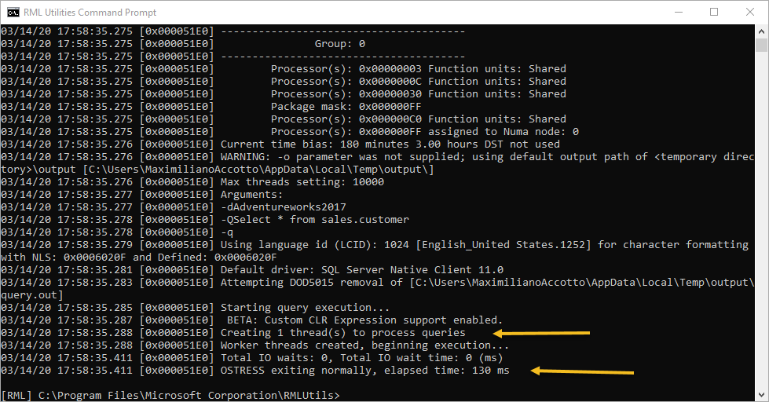
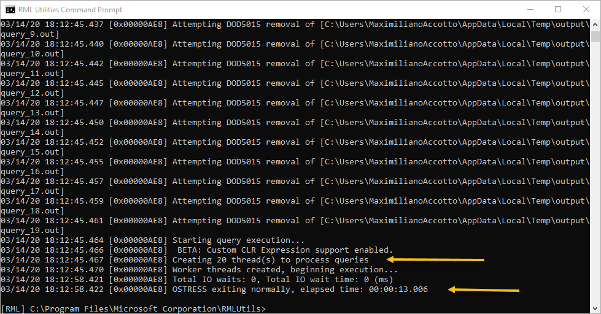
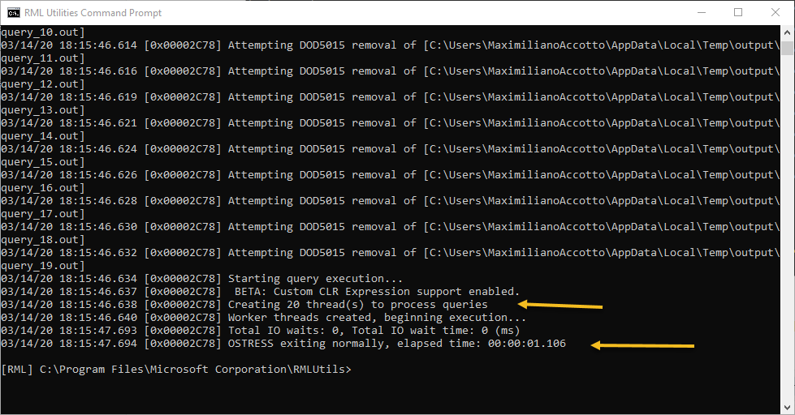
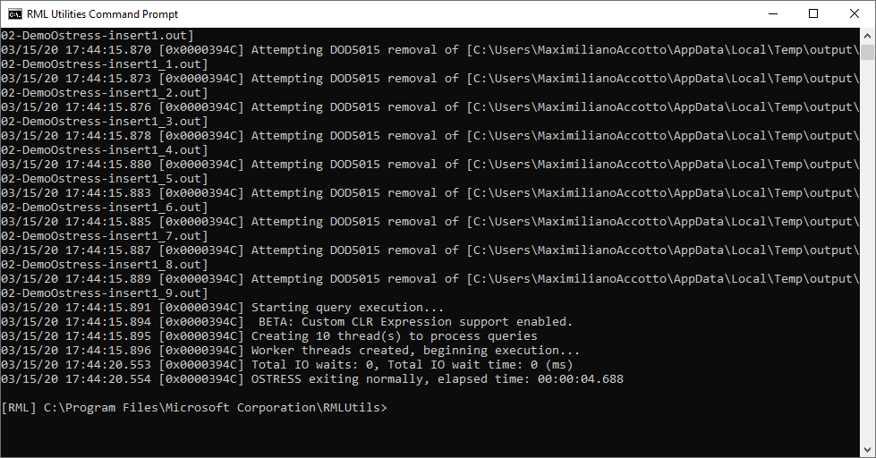

# Lab: RML Ostress

#### <i>Triggerdb Consulting SRL</i> | www.triggerdb.com | https://blogs.triggerdb.com

## Acerca de este workshop
Bienvenido/a a este Workshop armado por **Maximiliano Damian Accotto** Microsoft MVP en Data Platform y socio fundador de **Triggerdb Consulting SRL**

El objetivo de este workshop es que pueda aprender a usar la herramienta RML Ostress para poder realizar cargas de trabajo en una instancia MSSQL.

## 1. Requerimientos del Workshop

Para este workshop es necesario contar con los siguientes requerimientos.

1. Las herramientas RML instaladas  [link](./Readme.md)
2. Alguna de las bases de datos de ejemplo [AdventureWorks](https://github.com/Microsoft/sql-server-samples/releases/tag/adventureworks) 

## 2. Para que sirve Ostress

Esta herramienta nos permitirá hacer pruebas de carga sobre una base de datos MSSQL.

Estas pruebas de carga son muy importantes ya que con ellas podemos detectar temas de performance o escalabilidad de una query o solución

Imaginemos que tenemos un proceso al cual nos solicitan analizar si nuestro servidor soportara mas carga del mismo y como se comportara en tal caso, o bien analizar también un un proceso vs otro a nivel carga de performance.

## 3. Parámetros de Ostress

Estos son los distintos parámetros que podemos usar en la herramienta desde la linea de comando.

| Parámetro                                | Descripción                                     |
| ----------------------------------- | ----------------------------------------------- |
|  -S |name of Microsoft SQL Server server to connect to|
|  -D |ODBC data source name to use for connection|
|  -E |use Windows auhentication to connect (default)|
|  -U |login ID |
|  -P |password |
|  -d |database name |
|  -Q |"single batch query to process" |
|  -i |SQL/RML file name or file wildcard to process |
|  -n |number of connections processing each input file/query - stress mode |
|  -r |number of iterations for each connection to execute its input file/query |
|  -o | output directory to write query results and log file |
|  -l | login timeout (sec) |
|  -L | integer value representing the language id |
|  -t |query timeout (sec)|
|  -p |network packet size for connections - SQL Server only|
|  -q |quiet mode; suppress all query output|
|  -v |verbose mode; show additional diagnostic output|
|  -m |[stress | replay] run in stress or replay mode|
|  -a |default password to use for SQL authentication during replay|
|  -c |control file name - required for replay mode|
|  -T |enable trace flag|
|  -fx|write query results as XML|
|  -N |disable "OSTRESS exiting" message|
|  -M |Advanced setting: max threads allowed, 0 is default setting.|
|  -b |Stop processing if an error is encountered during query execution.|

## 4. Ejercicio 1 - Primer test simple

En este primer ejercicio haremos una prueba de carga para la siguiente consulta T-SQL 

```mssql
select * from Sales.Customer 
```

Para ello lo primero que haremos es iniciar la consola de windows shell RML






Escribiremos en nuestra consola la siguiente instrucción  

```shell
ostress -d"Adventureworks2017" -Q"Select * from sales.customer" -q
```

Aquí solamente le indicamos que no deseamos ver los resultados de la consulta y por eso hemos usado el parámetro **-q**

Al ejecutar Ostress observaremos un resultado en nuestra consola como el siguiente:



Los datos mas importantes para una carga de trabajo suelen ser los tiempos totales de proceso y si hubo o no esperas.

## 5. Ejercicio 2 - Emulando usuarios concurrentes

En este segundo ejercicio haremos una prueba para emular usuarios concurrentes e interacciones comparando dos consultas para ver sus tiempos de respuesta.

> Es aconsejable que entre vía SSMS mientras se hacen las pruebas y revise los request/sec del Activity Monitor

Consulta 1

```mssql
select * from Sales.Customer 
```

Consulta 2

```mssql
select CustomerID from Sales.Customer 
```

Para poder llevar adelante las pruebas de carga ejecutaremos los siguientes comandos desde nuestro shell

```shell
ostress -d"Adventureworks2017" -Q"Select * from sales.customer" -q -n20 -r25
```

Aquí le estamos indicando que genere 20 conexiones en paralelo de la misma consulta y lo repita por 25 veces .



Podemos observar que para 20 usuarios simultáneos esta carga nos ha demorado unos 13 segundos.

Ahora haremos la misma prueba pero para la otra consulta para que nos permita evaluar el comportamiento.

```shell
ostress -d"Adventureworks2017" -Q"Select CustomerID from sales.customer" -q -n20 -r25
```




Aquí podemos observar que para los 20 usuarios concurrentes la operación solo ha demorado 1 segundo.


## 6. Ejercicio 3 - usando archivos .sql

En este ejercicio usaremos archivos .sql los cuales emularan hacer insert sobre unas tablas.

Como primer paso bajaremos los script de la carpeta y los alojaremos en nuestro equipo local 

, por ejemplo en **"d:\DemoOstress"** .

El primer script que vamos a ejecutar es el de creación de objetos  

[01-DemoOstress-Setup.sql](./Ostress/01-DemoOstress-Setup.sql)

El mismo creara una base de datos con dos tablas para luego emular carga de insert sobre las mismas.

Luego de crear nuestra base de datos y tablas haremos las pruebas de carga usando los siguientes script

[02-DemoOstress-insert1.sql](./Ostress/02-DemoOstress-insert1.sql)

[03-DemoOstress-insert2.sql](./Ostress/03-DemoOstress-insert2.sql)

Ejecutaremos para nuestra primer prueba el siguiente comando desde el shell

```shell
ostress -dDemoostress -i"d:\Demoostress\02-DemoOstress-insert1.sql" -n10 -r1000 -q

```

Para nuestra segunda prueba ejecutaremos el siguiente comando desde el shell

```shell
ostress -dDemoostress -i"d:\Demoostress\03-DemoOstress-insert2.sql" -n10 -r1000 -q
```

En ambos casos estamos emulando 1000 insert en 10 conexiones concurrentes en donde luego podremos observar sus resultados.




## Próximo paso

[Workshop Readtrace](https://github.com/maccotto/WorkshopRML/blob/master/Lab%20RML%20Readtrace.md)
