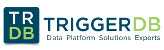
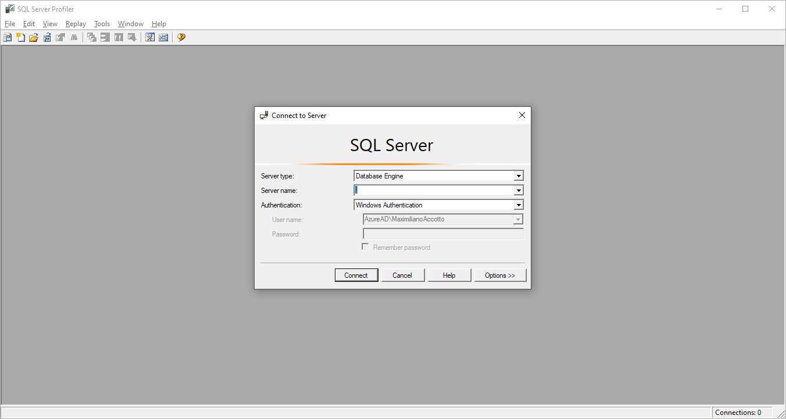
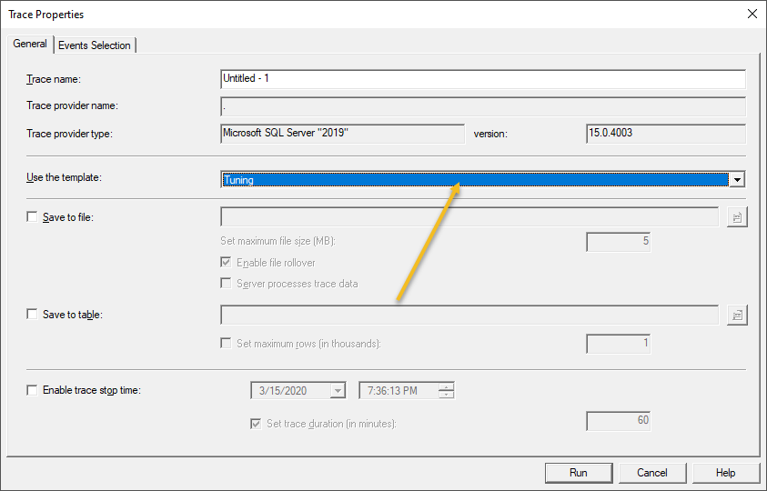
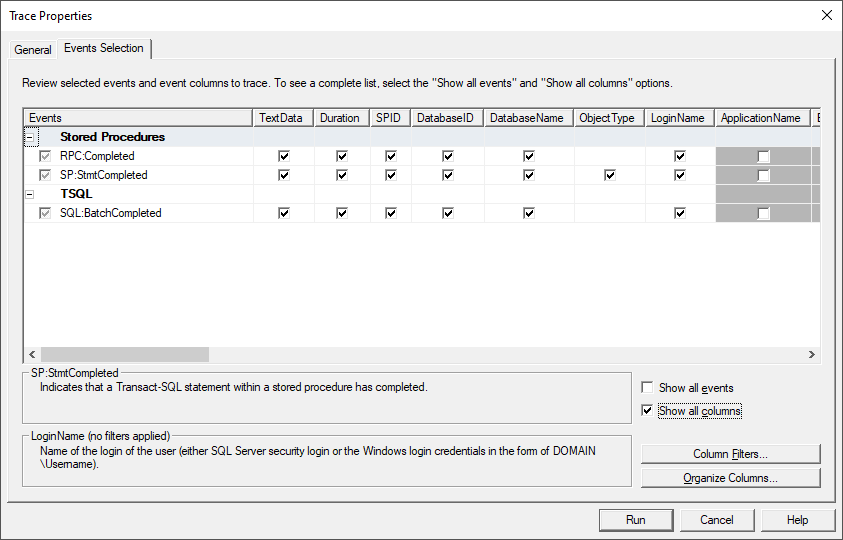
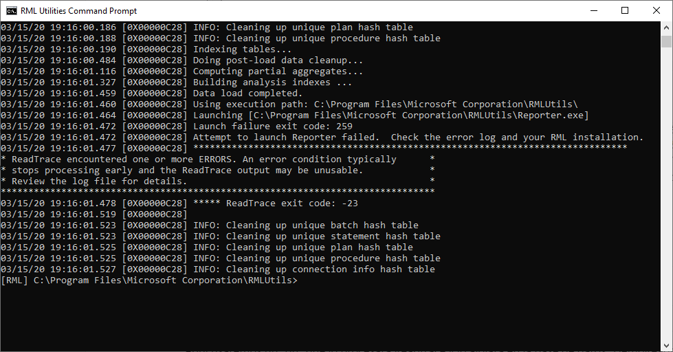
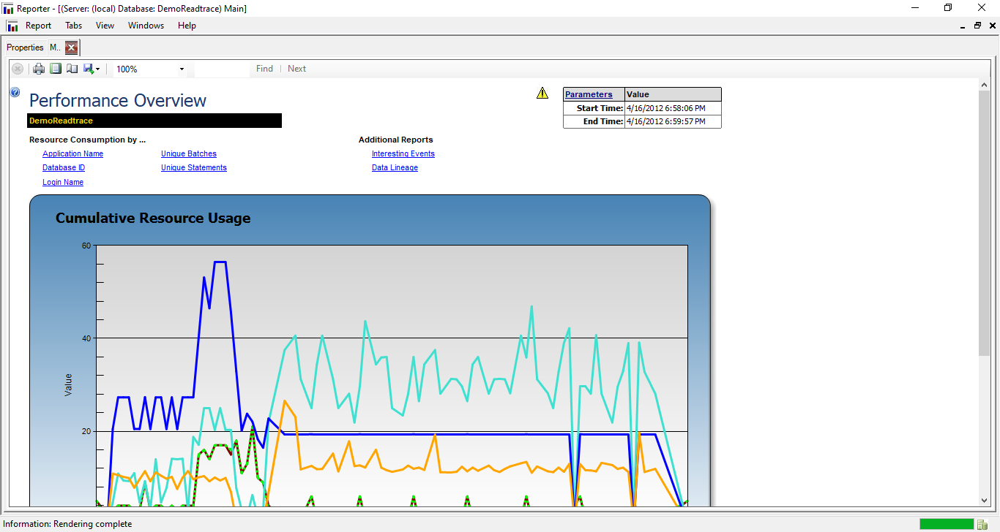
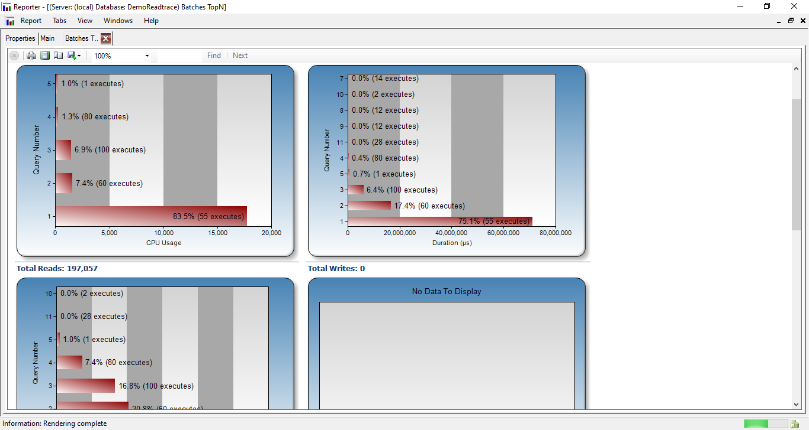
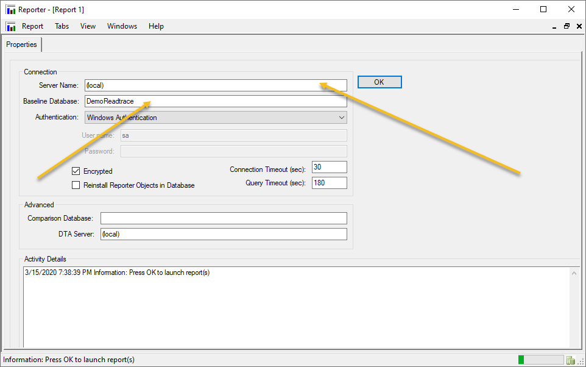

# Lab: RML Readtrace

#### <i>Triggerdb Consulting SRL</i> | www.triggerdb.com | https://blogs.triggerdb.com

##     Acerca de este workshop
Bienvenido/a a este Workshop armado por **Maximiliano Damian Accotto** Microsoft MVP en Data Platform y socio fundador de **Triggerdb Consulting SRL**

El objetivo de este workshop es que pueda aprender a usar la herramienta RML Readtrace para poder analizar trazas o extended events.

## 1. Requerimientos del Workshop

Para este workshop es necesario contar con los siguientes requerimientos.

1. Las herramientas RML instaladas  [link](./Readme.md)


## 2. Para que sirve Readtrace

Sin dudas que Readtrace es una de las herramientas mas importantes a la hora de hacer análisis de perfomance.

Cuando creamos una traza o extended event los mismos registraran cada proceso que suceda en nuestro servidor MSSQL. 

Ahora bien poder hacer un buen análisis de los mismos puede ser complejo ya que por ejemplo nos podría pasar que se ejecute la misma consulta varias veces y hasta con valores distintos.

Readtrace permite importar los datos de un TRC o XEL para poderlos llevar a una base de datos donde los datos no solo quedaran agrupados sino que también con Reporter nos podrá dar la posibilidad de analizar vía reportes los resultados.

## 3. Parámetros de ReadTrace

Estos son los distintos parámetros que podemos usar en la herramienta desde la linea de comando.


| Parámetro                               | Descripción                                     |
| ----------------------------------- | ----------------------------------------------- |
|-I | File name of the first .TRC or .XEL file to process [REQUIRED].|
|-i | If specified, indicates that the .TRC file(s) to process are present inside a CAB/ZIP/RAR file with this file name |
|-o | Full path of directory to place output files [default is current directory] |
|-S | Name of SQL Server 2005 server to connect to when loading performance analysis data |
|-d | Database to use when loading performance data [default is PerfAnalysis].|
|-E | Connect to SQL using Windows Authentication [default] |
|-U | Connect to SQL using this user name|
|-P | Password for the user specified in -U option|
|-a | Disable performance analysis|
|-f | Do not produce .RML output files for each Session and Request|
|-Q | Do normalization parse using quoted_identifier OFF symantics.  (Default is ON)|
|-r#| Read at most this # of files (including the first) |
|-M | Mirror trace events by Session to the specified output directory|
|-MF | Mirror trace events by Session to the specified output directory |
|-MS |Mirror trace events to a single .TRC file in the specified output directory.|
|-M[FS] or -M[SF]| Combine mirror filtering with single .TRC file output|

## 4. Creando una traza

Como primer paso lo que haremos es crear una traza a nivel servidor para poder capturar los eventos de performance, la misma la podremos dejar corriendo por ejemplo por el tiempo de 20 minutos en algún servidor MSSQL.

Para implementar la traza ejecute el script siguiente [PROFILER_PERFORMANCE.sql](./Readtrace/PROFILER_PERFORMANCE.sql) usando su SQL Server Management Studio o Azure Data Studio

> Antes de ejecutar el script revise los datos de alojamiento para el TRC 

```mssql
set @filename = 'e:\tmp\' + convert(nvarchar(255),host_name()) + '_' 
                + convert(nvarchar(10),getdate(),112) + '.trc' 
```

> Revise los permisos de su login antes de iniciar la traza con el siguiente [link](https://docs.microsoft.com/en-us/sql/tools/sql-server-profiler/permissions-required-to-run-sql-server-profiler?view=sql-server-ver15)
>

Si desea usted crear un script mas personalizado entonces siga estos pasos

1. Inicie el profiler
2. Seleccione en el menú File --> New Trace y acceda al servidor



3. Seleccione luego el Template **Tunning**

   



4. Seleccione las siguientes columnas como mínimo:

   CPU

   Reads

   Writes

   ApplicationName

   

   

## 5. Usando readtrace

Desde nuestra consola shell de windows podremos ejecutar el siguiente comando.

```shell
readtrace -I"E:\Rml\Readtrace\TrazaDemo.trc" -dDemoReadtrace
```

Aquí usaremos un .TRC que lo procesara Readtrace y lo alojara en la base de datos "DemoReadtrace"



La misma herramienta luego de procesar la traza ejecutara reporter para poder analizar los resultados.






## 6. Usando Reporter

Reporter es la herramienta de las RML que nos permite sacar reportes y exportarlos por ejemplo a excel sobre una base de datos procesada por ReadTrace.

Para poder usar Reporter siga los siguientes pasos:

1. Abra el RML Shell 
2. Escriba "Reporter"

```shell
C:\Program Files\Microsoft Corporation\RMLUtils>Reporter.exe
```

Luego de iniciar la herramienta, seleccione la base de datos en la cual ha procesado el ReadTrace



Haga clic luego sobre el botón **"OK"** para así poder acceder al reporte


