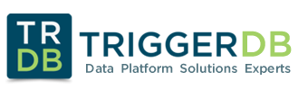

# Lab: Herramientas SQL Server RML

#### <i>Triggerdb Consulting SRL</i> | www.triggerdb.com | https://blogs.triggerdb.com

## Acerca de este workshop

Bienvenido/a a este Workshop armado por **Maximiliano Damian Accotto** Microsoft MVP en Data Platform y socio fundador de **Triggerdb Consulting SRL**

El objetivo de este workshop es que pueda aprender a usar las distintas herramientas RML las cuales son de gran ayuda para hacer trabajos como

1. Análisis de trazas o eventos extendidos
2. Hacer pruebas de carga (Stress)

<h2><b>     Agenda</b></h2>

En este workshop veremos los siguientes temas

| Tema                                | Descripción                                     |
| ----------------------------------- | ----------------------------------------------- |
| [Introducción](#introducción)   |                                                 |
| [Instalación](#instalación)     | Instalar las herramientas                       |
| [Ostress](./Lab%20RML%20Ostress.md) | Usando Ostress para emular cargas de trabajo    |
| [Readtrace](./Lab%20RML%20Readtrace.md)| Analizando trc o Extended Events de performance |

## Introducción

Las RML son herramientas de linea de comando que ya tienen unos cuantos años de estar disponibles.

Estas herramientas son distribuidas por el equipo de soporte de **Microsoft**  totalmente gratuita .

Dentro de las utilidades se encuentran

| Nombre    | Descripción                                 |
| --------- | ------------------------------------------- |
| ReadTrace | Permite analizar trc o xtend events         |
| Reporter  | Permite visualizar los datos de Readtrace   |
| Ostress   | Permite realizar cargas de trabajo (stress) |

## Instalación

Como primer paso lo que debemos hacer es instalar las herramientas en nuestro equipo (no es necesario hacerlo sobre los servidores de MSSQL).

Para ello lo que haremos primero es acceder al siguiente [link](https://www.microsoft.com/en-us/download/details.aspx?id=4511) e instalarlas en tu equipo local.

Luego de hacer dicha instalación se recomienda hacer una actualización de las mismas si es que va a usar trazas de SQL Server 2016 o 2017.

Para dicho fin siga las siguientes instrucciones

1. Descargue la herramienta Database Experimentation Assistant (DEA) desde el siguiente [link]( https://www.microsoft.com/en-us/download/details.aspx?id=54090) 

2. Instale la herramienta en su equipo local.
3. Copie los 4 archivos de la carpeta "C:\Program Files (x86)\Microsoft Corporation\Database Experimentation Assistant\Dependencies\X64" a "C:\Program Files\Microsoft Corporation\RMLUtils"

Luego de instalar las herramientas podremos acceder al cmd shell desde windows

